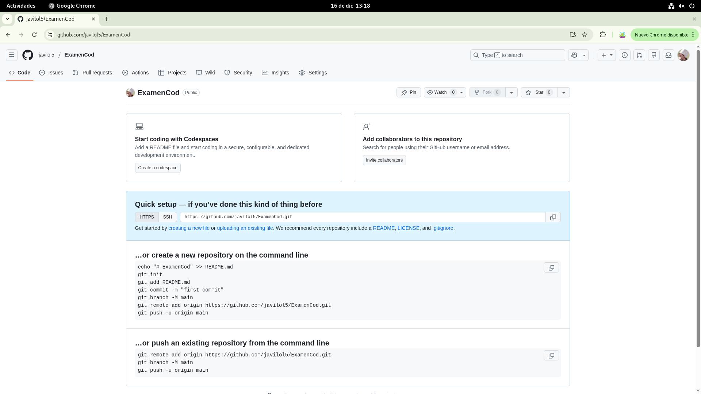
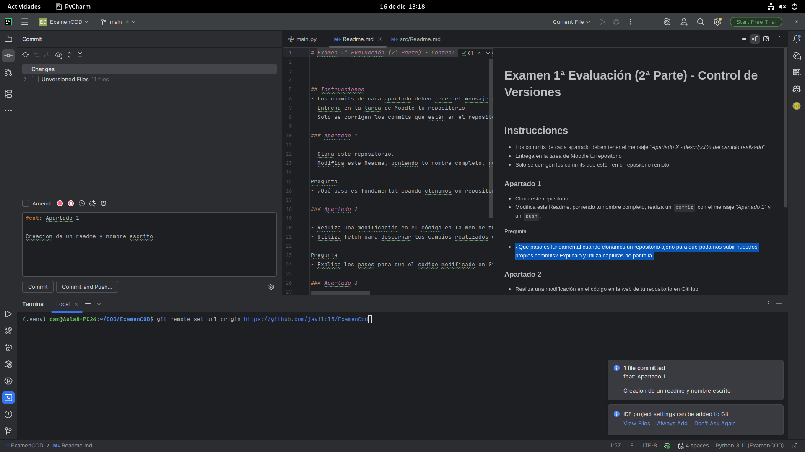
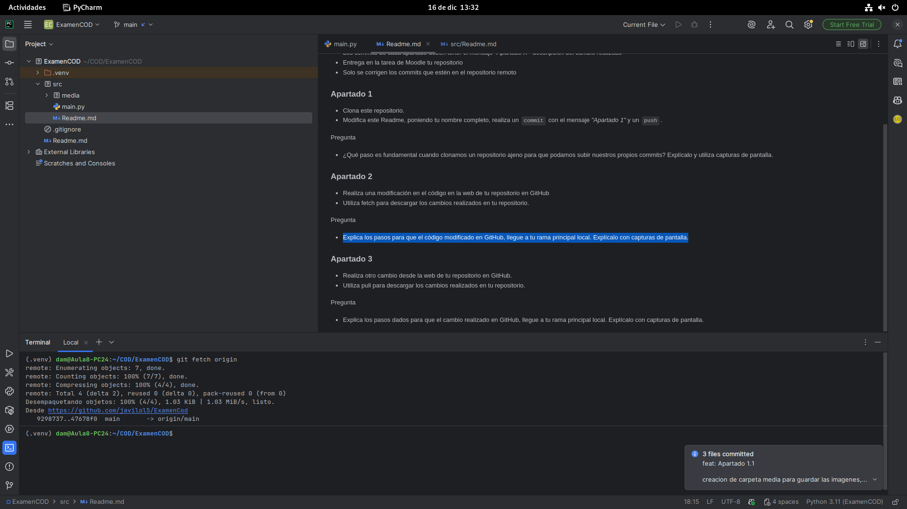

# Javier Casal Gonzalez

### Apartado 1
Respuesta = 
```Cambiar el origen del repositorio remoto para que apunte a tu propio repositorio en GitHub.```





### Apartado 2

Respuesta = 
```Primero situarse en la rama principal local, descargar los cambios del repositorio remoto revisar los cambios descargados, fusionar los cambios en la rama principal local y comprobar que los cambios ya están en local```





### Apartado 3

Respuesta = 
```Primero situarse en la rama principal local, y hacer git pull origin main el cual descarga y fusiona los cambios del repositorio remoto en un solo paso```

